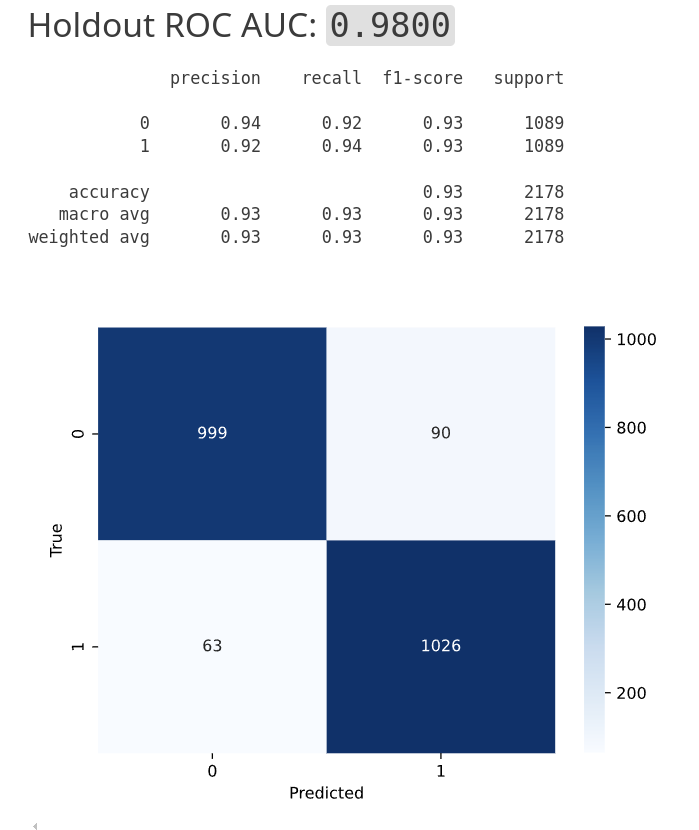

# WIDS 2019 Datathon

### Project and Data Source: <https://www.kaggle.com/competitions/widsdatathon2019/overview>

### Purpose

Oil Palm Plantations are responsible for a large amount of deforestation. The goal of this project is to develop a model that can identify oil palm plantations in satellite images. This model can be used to monitor deforestation and help enforce laws that protect the environment.

### Primary Libraries Used: PyTorch/Torchvision

### Results

* Using a pre-trained ResNet-50 model, we were able to achieve a 0.93 F1 score and an **ROC-AUC of 0.98** on the holdout set.
* We also built a pre-trained ResNet-18 model which can be trained and used on a CPU. This model achieved an F1 score of 0.88 and an ROC-AUC of 0.959 on the holdout set.

 

